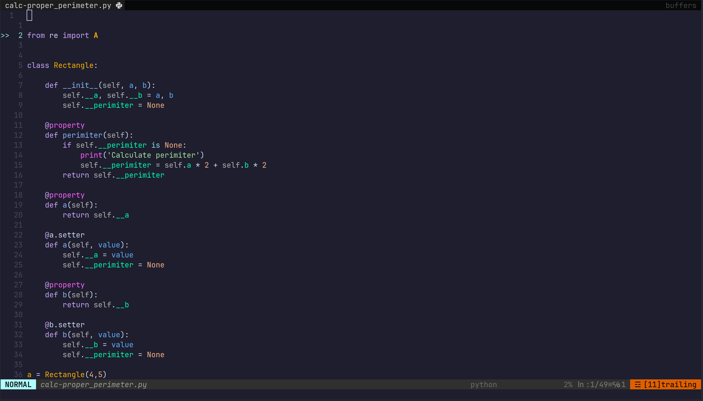

# MinVim

## Requirements

- Vimplug
- Nerd font (To display devicons correctly)

## Includes

- Basic neutral theme and airline, that can be customed/uninstalled
- Simple config, that uses Conquer of Completion to start JS and Python LSP servers
- Snippets for most files (like !!! in Vscode), that can be customed

## Idea

I guess it'll be useful for people like me, who just want to try nvim with comfort and to control everything, but don't wanna set up big nvim ide's like LazyVim and etc. (I don't have anything against it)

## About

So, I'm complete rookie in vimscript, lua and other interesting vim stuff, so don't blame me for shitcode/
